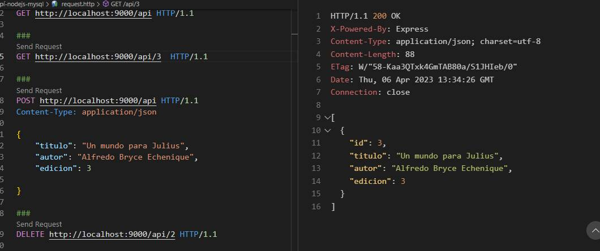

# API REST WITH NODEJS, EXPRESS, MYSQL.
Code to create API REST and testing with REST CLIENT.

## STACK TECH :wrench: :hammer:

* Node Js
* Express
* Mysql
* Extension VSCode REST CLIENT

# Commands 
* npm init -y 
* npm install express
* node server. js (for start server 1st option)
* npm i nodemon --save-dev (2nd option)
    * npm run start
* npm i mysql express-myconnection (for use mysql)

# SCREENSHOT

 